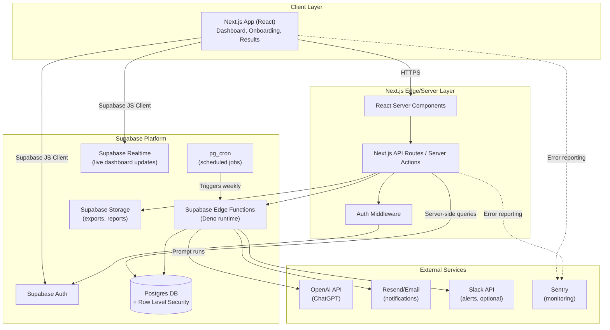
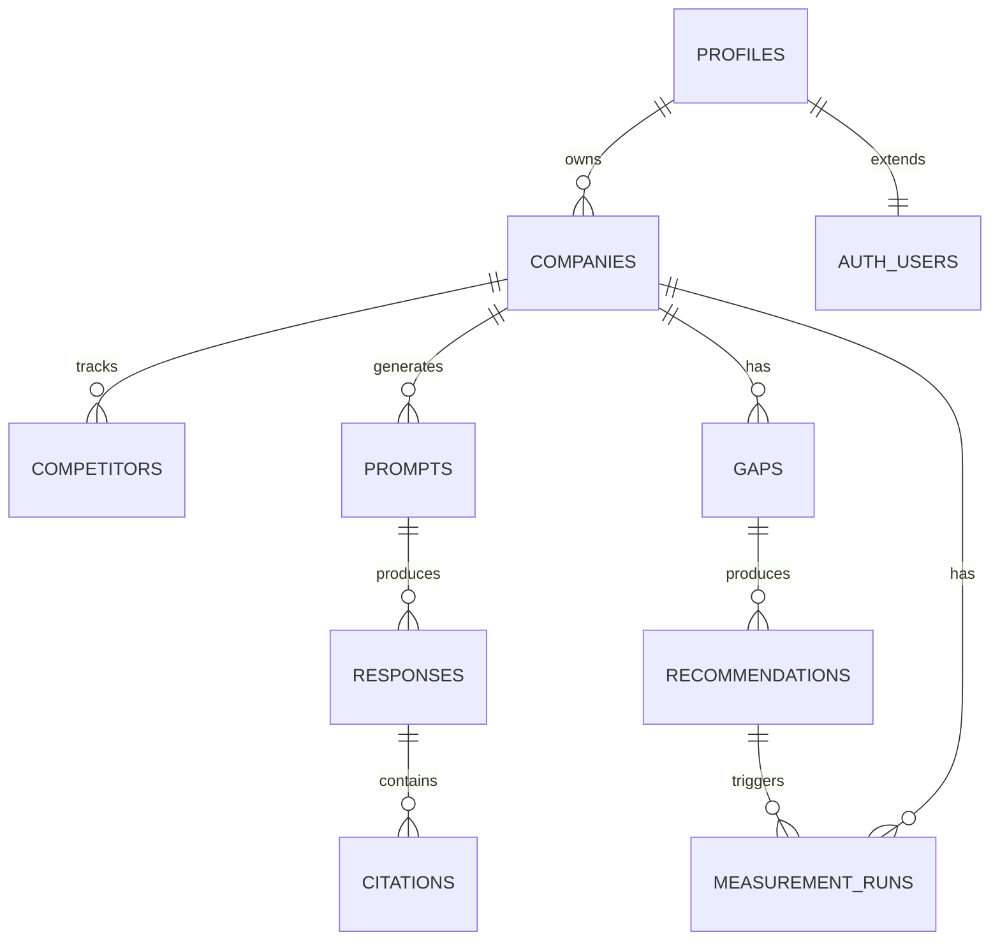
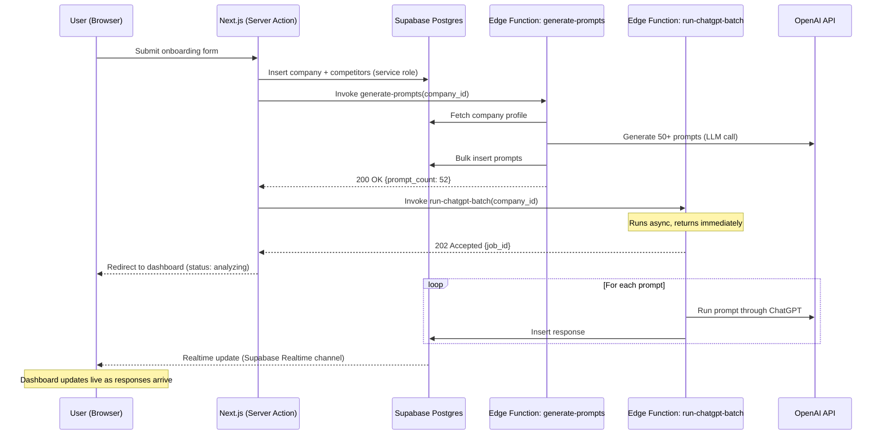
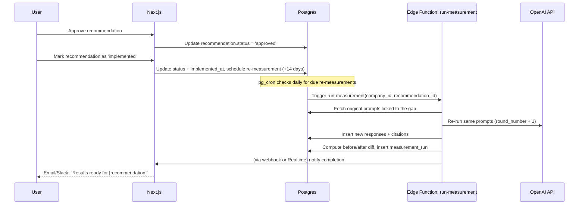
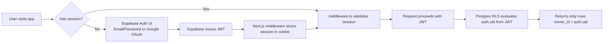

# Neptune — Technical Architecture Document
**Product:** Neptune, by 99sols.ai  
**Version:** 1.0  
**Stack:** Next.js (React) + Supabase (Postgres, Auth, Storage, Edge Functions)  
**Last Updated:** September 2026  
**Companion Doc:** `PRD.md`

> Wherever "Neptune" appears as a brand mark in the app (header/logo, tab title, auth screens, emails, exports) — as opposed to a plain in-text mention — show "by 99sols.ai" beneath/beside it. See `prd.md` Branding Convention for the full rule.

---

## 1. Architecture Philosophy

Neptune's architecture is built around one principle: **the AI visibility loop (Observe → Diagnose → Act → Measure → Learn) must be traceable end-to-end** — every recommendation must be able to point back to the exact prompt, response, and citation that generated it, and every measurement must point back to the exact action that triggered it.

This means the architecture prioritizes:
1. **Immutable event data** — raw AI responses are never edited, only re-run and versioned
2. **Traceability over normalization** — some data is intentionally denormalized so lineage (prompt → citation → gap → recommendation → measurement) stays queryable without complex joins
3. **Serverless-first** — Supabase + Next.js means no servers to manage for MVP-to-early-scale; move to dedicated workers only when job volume demands it
4. **Row-level security by default** — every company's data is isolated at the database layer, not just the application layer, from day one

---

## 2. High-Level System Architecture



**Why this split:**
- **Next.js** owns everything user-facing: onboarding, dashboard rendering, auth UI, approving recommendations
- **Supabase Edge Functions** own everything long-running or scheduled: prompt generation, OpenAI batch calls, citation parsing, measurement re-runs — kept out of Next.js request/response cycle to avoid serverless timeout limits
- **Postgres + RLS** is the single source of truth and the security boundary — even if application code has a bug, a company can never query another company's data

---

## 3. Tech Stack

| Layer | Technology | Rationale |
|-------|-----------|-----------|
| Frontend Framework | **Next.js 15 (App Router)** | Server Components reduce client bundle; Server Actions simplify mutations without a separate API layer |
| UI Library | **React 19** | Ships with Next.js; concurrent rendering for dashboard interactivity |
| Styling | **Tailwind CSS + shadcn/ui** | Fast, consistent component styling; shadcn gives accessible primitives (tables, dialogs, tabs) out of the box |
| State/Data Fetching | **TanStack Query** (client) + **Server Components** (initial load) | Server Components for first paint, TanStack Query for polling/refetching (e.g., measurement status) |
| Charts | **Recharts** | Before/after trend lines, competitive positioning charts |
| Motion/Animation | **Framer Motion** (`motion` npm package) | 3D-feel hero/parallax animation on the marketing site (`prd.md` Feature 4.3) and in-app micro-interactions on the dashboard (Feature 4.2 — tab transitions, metric count-ups, card entrances); client-side only via `'use client'` islands so it doesn't bloat server-rendered routes |
| Database | **Supabase Postgres** | Managed Postgres with built-in RLS, generous free tier, scales to dedicated instance later |
| Auth | **Supabase Auth** | Email/password + OAuth (Google) out of the box; issues JWT consumed by RLS policies |
| Backend Logic (short) | **Next.js Server Actions / Route Handlers** | CRUD operations, form submissions, approve/reject actions |
| Backend Logic (long-running) | **Supabase Edge Functions (Deno)** | Prompt generation, OpenAI batch runs, citation parsing — anything that can exceed Next.js serverless timeout (10-60s depending on host) |
| Scheduled Jobs | **pg_cron (Supabase)** + Edge Function triggers | Weekly prompt re-runs, measurement scheduling |
| File Storage | **Supabase Storage** | Exported PDF/CSV reports, cached raw response archives |
| Realtime Updates | **Supabase Realtime (Postgres CDC)** | Live dashboard updates while analysis is running ("Generating prompts... Running analysis...") |
| AI Integration | **OpenAI API (`openai` npm SDK)** | ChatGPT access for MVP engine |
| Email | **Resend** | Transactional emails (onboarding, weekly digest, action reminders) |
| Monitoring | **Sentry** | Error tracking across Next.js + Edge Functions |
| Hosting (Frontend) | **Vercel** | Native Next.js support, edge network, zero-config deploys |
| Hosting (Backend) | **Supabase Cloud** | DB, Auth, Edge Functions, Storage all co-located |
| CI/CD | **GitHub Actions + Vercel Git Integration** | Auto-deploy on merge to main; Supabase migrations run via CLI in CI |

---

## 4. Project Structure

```
neptune/
├── PRD.md
├── ARCHITECTURE.md                      # This file
├── apps/
│   └── web/                             # Next.js app
│       ├── app/
│       │   ├── (auth)/
│       │   │   ├── login/page.tsx
│       │   │   └── signup/page.tsx
│       │   ├── (onboarding)/
│       │   │   └── onboarding/page.tsx          # Feature 4.1
│       │   ├── (dashboard)/
│       │   │   ├── layout.tsx                   # Sidebar nav, auth guard
│       │   │   ├── overview/page.tsx            # Feature 4.2 - Overview tab
│       │   │   ├── gaps/page.tsx                # Feature 4.2 - Gaps tab
│       │   │   ├── recommendations/page.tsx     # Feature 4.2 - Recommendations tab
│       │   │   ├── results/page.tsx             # Feature 4.2 - Results tab
│       │   │   └── settings/page.tsx
│       │   ├── api/
│       │   │   ├── companies/route.ts
│       │   │   ├── analyze/route.ts             # Triggers Edge Function
│       │   │   └── webhooks/
│       │   │       └── supabase/route.ts        # Realtime/DB webhook receiver
│       │   └── layout.tsx
│       ├── components/
│       │   ├── ui/                              # shadcn primitives
│       │   ├── dashboard/
│       │   │   ├── VisibilityChart.tsx
│       │   │   ├── CompetitorScorecard.tsx
│       │   │   ├── GapCard.tsx
│       │   │   ├── RecommendationCard.tsx
│       │   │   └── BeforeAfterTable.tsx
│       │   └── onboarding/
│       │       └── OnboardingForm.tsx
│       ├── lib/
│       │   ├── supabase/
│       │   │   ├── client.ts                    # Browser client
│       │   │   ├── server.ts                    # Server Component client
│       │   │   └── middleware.ts                # Auth session refresh
│       │   ├── actions/                         # Server Actions
│       │   │   ├── companies.ts
│       │   │   ├── recommendations.ts
│       │   │   └── measurements.ts
│       │   └── types/
│       │       └── database.types.ts            # Generated from Supabase schema
│       └── middleware.ts                        # Route protection
├── supabase/
│   ├── migrations/                      # SQL migration files (versioned)
│   ├── functions/                       # Edge Functions (Deno)
│   │   ├── generate-prompts/            # Feature 1.1
│   │   │   └── index.ts
│   │   ├── run-chatgpt-batch/           # Feature 1.2
│   │   │   └── index.ts
│   │   ├── extract-citations/           # Feature 1.3
│   │   │   └── index.ts
│   │   ├── analyze-competitors/         # Feature 1.4
│   │   │   └── index.ts
│   │   ├── analyze-gaps/                # Feature 1.5
│   │   │   └── index.ts
│   │   ├── map-content-gaps/            # Feature 1.6
│   │   │   └── index.ts
│   │   ├── generate-recommendations/    # Feature 2.1
│   │   │   └index.ts
│   │   ├── run-measurement/             # Feature 3.1
│   │   │   └── index.ts
│   │   └── _shared/                     # Shared Deno utilities (OpenAI client, CORS)
│   ├── seed.sql                         # Local dev seed data
│   └── config.toml
├── .github/
│   └── workflows/
│       ├── deploy-web.yml
│       └── deploy-supabase.yml
└── package.json                         # Monorepo root (pnpm workspaces or Turborepo)
```

**Why Edge Functions are split one-per-service:** mirrors the PRD's Feature numbering exactly (1.1 → `generate-prompts`, 1.2 → `run-chatgpt-batch`, etc.), so each function has a single responsibility, can be tested/deployed independently, and can be prompted to Claude Code in isolation without touching unrelated logic.

---

## 5. Database Schema (Postgres / Supabase)

### 5.1 Entity Relationship Overview



### 5.2 Core Tables (SQL)

```sql
-- ============================================
-- PROFILES (extends Supabase auth.users)
-- ============================================
create table public.profiles (
  id uuid primary key references auth.users(id) on delete cascade,
  full_name text,
  email text not null,
  role text default 'member' check (role in ('owner', 'member', 'admin')),
  created_at timestamptz default now()
);

-- ============================================
-- COMPANIES
-- ============================================
create table public.companies (
  id uuid primary key default gen_random_uuid(),
  owner_id uuid references public.profiles(id) not null,
  name text not null,
  domain text not null,
  industry text not null check (industry in ('saas', 'professional_services', 'ecommerce', 'other')),
  products_services text[],
  target_market text,
  business_goals text,
  onboarding_completed boolean default false,
  created_at timestamptz default now(),
  updated_at timestamptz default now()
);

create index idx_companies_owner on public.companies(owner_id);

-- ============================================
-- COMPETITORS
-- ============================================
create table public.competitors (
  id uuid primary key default gen_random_uuid(),
  company_id uuid references public.companies(id) on delete cascade not null,
  name text not null,
  domain text not null,
  auto_detected boolean default false,
  created_at timestamptz default now()
);

create index idx_competitors_company on public.competitors(company_id);

-- ============================================
-- PROMPTS (Feature 1.1)
-- ============================================
create table public.prompts (
  id uuid primary key default gen_random_uuid(),
  company_id uuid references public.companies(id) on delete cascade not null,
  text text not null,
  category text not null check (category in ('problem_awareness', 'comparison', 'feature', 'use_case', 'competitive')),
  active boolean default true,           -- allows retiring stale prompts without deleting history
  created_at timestamptz default now()
);

create index idx_prompts_company on public.prompts(company_id);

-- ============================================
-- RESPONSES (Feature 1.2) — immutable, append-only
-- ============================================
create table public.responses (
  id uuid primary key default gen_random_uuid(),
  prompt_id uuid references public.prompts(id) on delete cascade not null,
  engine text not null default 'chatgpt' check (engine in ('chatgpt', 'perplexity', 'claude', 'gemini', 'google_ai_overview')),
  full_text text not null,
  raw_sources jsonb,                     -- raw citation payload before parsing
  measurement_round int not null default 1,  -- 1 = baseline, 2+ = post-action re-runs
  model_version text,                    -- e.g. 'gpt-4-turbo-2024-04-09' for reproducibility
  created_at timestamptz default now()
);

create index idx_responses_prompt on public.responses(prompt_id);
create index idx_responses_round on public.responses(measurement_round);

-- ============================================
-- CITATIONS (Feature 1.3)
-- ============================================
create table public.citations (
  id uuid primary key default gen_random_uuid(),
  response_id uuid references public.responses(id) on delete cascade not null,
  domain text not null,
  url text,
  brand_mentioned text,                  -- matched company or competitor name
  entity_type text check (entity_type in ('own_company', 'competitor', 'third_party_source')),
  context text check (context in ('recommended', 'compared', 'alternative', 'warning', 'neutral_mention')),
  confidence_score numeric(3,2),         -- 0.00–1.00, for low-confidence flagging (Feature 1.3 spec)
  needs_review boolean default false,
  created_at timestamptz default now()
);

create index idx_citations_response on public.citations(response_id);
create index idx_citations_domain on public.citations(domain);

-- ============================================
-- GAPS (Feature 1.5)
-- ============================================
create table public.gaps (
  id uuid primary key default gen_random_uuid(),
  company_id uuid references public.companies(id) on delete cascade not null,
  prompt_id uuid references public.prompts(id),
  gap_type text not null check (gap_type in ('visibility_gap', 'substitution_gap', 'authority_gap', 'coverage_gap', 'format_gap', 'evidence_gap', 'tone_gap', 'social_proof_gap')),
  description text not null,
  google_rank int,                       -- manually entered or Search Console import (post-MVP)
  competitor_citation_count int default 0,
  own_citation_count int default 0,
  priority text not null check (priority in ('high', 'medium', 'low')),
  priority_score numeric,                -- computed score for sorting
  status text default 'open' check (status in ('open', 'addressed', 'dismissed')),
  created_at timestamptz default now()
);

create index idx_gaps_company on public.gaps(company_id);
create index idx_gaps_priority on public.gaps(priority);

-- ============================================
-- RECOMMENDATIONS (Feature 2.1)
-- ============================================
create table public.recommendations (
  id uuid primary key default gen_random_uuid(),
  company_id uuid references public.companies(id) on delete cascade not null,
  gap_id uuid references public.gaps(id),
  action_type text not null check (action_type in ('create_content', 'optimize_existing', 'authority_building', 'internal_linking')),
  title text not null,
  description text not null,
  implementation_example text,
  evidence text,                          -- "Competitor X cited 8x for this topic"
  expected_impact text not null check (expected_impact in ('high', 'medium', 'low')),
  time_estimate_hours int,
  status text default 'pending' check (status in ('pending', 'approved', 'rejected', 'in_progress', 'implemented', 'skipped')),
  implemented_at timestamptz,
  implementation_notes text,
  created_at timestamptz default now(),
  updated_at timestamptz default now()
);

create index idx_recommendations_company on public.recommendations(company_id);
create index idx_recommendations_status on public.recommendations(status);

-- ============================================
-- MEASUREMENT_RUNS (Feature 3.1, 3.2)
-- ============================================
create table public.measurement_runs (
  id uuid primary key default gen_random_uuid(),
  company_id uuid references public.companies(id) on delete cascade not null,
  round_number int not null,              -- 1 = baseline
  triggered_by_recommendation_id uuid references public.recommendations(id),
  brand_citations_count int,
  brand_recommendation_count int,
  citation_share numeric(5,2),
  recommendation_share numeric(5,2),
  competitor_snapshot jsonb,              -- {competitor_id: {citations, recommendations}} at time of run
  confidence_level numeric(5,2),
  status text default 'pending' check (status in ('pending', 'running', 'completed', 'failed')),
  started_at timestamptz,
  completed_at timestamptz,
  created_at timestamptz default now()
);

create index idx_measurement_company on public.measurement_runs(company_id);
create index idx_measurement_round on public.measurement_runs(round_number);
```

### 5.3 Row Level Security (RLS) Policies

RLS is **mandatory, not optional** — this is the actual security boundary since Supabase exposes the DB directly to the client via PostgREST.

```sql
-- Enable RLS on all tables
alter table public.companies enable row level security;
alter table public.competitors enable row level security;
alter table public.prompts enable row level security;
alter table public.responses enable row level security;
alter table public.citations enable row level security;
alter table public.gaps enable row level security;
alter table public.recommendations enable row level security;
alter table public.measurement_runs enable row level security;

-- COMPANIES: users can only see/edit their own company
create policy "Users can view own companies"
  on public.companies for select
  using (owner_id = auth.uid());

create policy "Users can insert own companies"
  on public.companies for insert
  with check (owner_id = auth.uid());

create policy "Users can update own companies"
  on public.companies for update
  using (owner_id = auth.uid());

-- CHILD TABLES: cascade access through company ownership
-- Pattern repeated for competitors, prompts, gaps, recommendations, measurement_runs
create policy "Users can view own company competitors"
  on public.competitors for select
  using (
    company_id in (select id from public.companies where owner_id = auth.uid())
  );

create policy "Users can view own company prompts"
  on public.prompts for select
  using (
    company_id in (select id from public.companies where owner_id = auth.uid())
  );

-- RESPONSES/CITATIONS: nested one level deeper (via prompt -> company)
create policy "Users can view own company responses"
  on public.responses for select
  using (
    prompt_id in (
      select id from public.prompts where company_id in (
        select id from public.companies where owner_id = auth.uid()
      )
    )
  );

create policy "Users can view own company citations"
  on public.citations for select
  using (
    response_id in (
      select id from public.responses where prompt_id in (
        select id from public.prompts where company_id in (
          select id from public.companies where owner_id = auth.uid()
        )
      )
    )
  );

-- RECOMMENDATIONS: users can update status (approve/reject)
create policy "Users can view own recommendations"
  on public.recommendations for select
  using (company_id in (select id from public.companies where owner_id = auth.uid()));

create policy "Users can update own recommendations"
  on public.recommendations for update
  using (company_id in (select id from public.companies where owner_id = auth.uid()));

-- SERVICE ROLE: Edge Functions bypass RLS using the service_role key
-- (writes from generate-prompts, run-chatgpt-batch, etc. use service_role, never anon key)
```

**Implemented migration (`supabase/migrations/20261001000000_initial_schema.sql`) hardens the policies above:** RLS is also enabled on `profiles` (self-read/update only, rows created by an `on_auth_user_created` trigger), every UPDATE policy has a matching `WITH CHECK` so a row can't be reassigned to another company, and child-table checks go through a `security definer` helper `owns_company(company_id)`. The migration is the source of truth for the exact SQL.

**Note for multi-seat teams (post-MVP):** when companies have multiple team members, replace `owner_id = auth.uid()` checks with a `company_members` join table and update policies to `company_id in (select company_id from company_members where user_id = auth.uid())`.

---

## 6. Core Workflows (Sequence Diagrams)

### 6.1 Onboarding → First Analysis



### 6.2 Recommendation → Measurement Loop



---

## 7. Edge Function Responsibilities (1:1 with PRD Features)

| Edge Function | PRD Feature | Trigger | Timeout Risk Mitigation |
|---------------|-------------|---------|--------------------------|
| `generate-prompts` | 1.1 | Server Action on onboarding submit | Single LLM call, fast (<30s) |
| `run-chatgpt-batch` | 1.2 | Invoked after prompts generated; also weekly via pg_cron | Fire-and-forget pattern: Edge Function queues individual prompt runs rather than awaiting all 50 synchronously; processes in batches of 5-10 with `Promise.allSettled` |
| `extract-citations` | 1.3 | Triggered per-response via Postgres trigger/webhook after insert | Runs per-response (small payload), not batched — avoids timeout entirely |
| `analyze-competitors` | 1.4 | Invoked after all citations extracted for a batch | Aggregation query, fast |
| `analyze-gaps` | 1.5 | Invoked after competitor analysis completes | Depends on manual Google rank input (MVP) — no external API call, fast |
| `map-content-gaps` | 1.6 | Invoked after gap analysis | Includes a site crawl step (sitemap fetch) — kept separate so a slow crawl doesn't block gap analysis |
| `generate-recommendations` | 2.1 | Invoked after content gap mapping | LLM call per gap batch; chunked to stay under timeout |
| `run-measurement` | 3.1 | pg_cron (checks daily for due re-measurements) + manual trigger | Same batching pattern as `run-chatgpt-batch` |

**Batching pattern (used in `run-chatgpt-batch` and `run-measurement`):**
```typescript
// supabase/functions/run-chatgpt-batch/index.ts (excerpt)
const BATCH_SIZE = 8;
for (let i = 0; i < prompts.length; i += BATCH_SIZE) {
  const batch = prompts.slice(i, i + BATCH_SIZE);
  await Promise.allSettled(batch.map(p => runPromptAndStore(p)));
  // Edge Functions have a max wall-clock limit — for >60 prompts,
  // queue remaining batches via a follow-up invocation rather than looping in one call
}
```

---

## 8. Authentication & Authorization Flow



- **`middleware.ts`** refreshes the Supabase session on every request and redirects unauthenticated users away from `(dashboard)` routes
- Server Components use `lib/supabase/server.ts` (cookie-based client) so RLS applies automatically on every server-side data fetch
- Edge Functions use the `service_role` key (bypasses RLS) since they act as trusted backend processes — **never expose `service_role` key to the client**

---

## 9. Realtime Dashboard Updates

Used specifically for the "analysis in progress" state during onboarding (PRD Feature 4.1, Step 4):

```typescript
// components/dashboard/AnalysisProgress.tsx (excerpt)
const channel = supabase
  .channel(`company-${companyId}-responses`)
  .on(
    'postgres_changes',
    { event: 'INSERT', schema: 'public', table: 'responses' },
    (payload) => {
      setCompletedCount((prev) => prev + 1);
    }
  )
  .subscribe();
```

This replaces polling — the dashboard shows "Analyzing... 23/52 prompts complete" live as `run-chatgpt-batch` inserts rows, with zero extra API calls from the client.

---

## 10. Scheduled Jobs (pg_cron)

```sql
-- Weekly baseline refresh for active companies
select cron.schedule(
  'weekly-prompt-refresh',
  '0 6 * * 1',  -- Every Monday 6am UTC
  $$
    select net.http_post(
      url := 'https://<project-ref>.supabase.co/functions/v1/run-chatgpt-batch',
      headers := '{"Authorization": "Bearer <service_role_key>"}'::jsonb,
      body := jsonb_build_object('trigger', 'scheduled_weekly')
    );
  $$
);

-- Daily check for due re-measurements (14 days after implementation)
select cron.schedule(
  'check-due-measurements',
  '0 8 * * *',  -- Daily 8am UTC
  $$
    select net.http_post(
      url := 'https://<project-ref>.supabase.co/functions/v1/run-measurement',
      headers := '{"Authorization": "Bearer <service_role_key>"}'::jsonb,
      body := jsonb_build_object('trigger', 'scheduled_check')
    );
  $$
);
```

---

## 11. API Surface (Next.js Route Handlers / Server Actions)

| Method | Path / Action | Purpose | Auth |
|--------|---------------|---------|------|
| Server Action | `createCompany(formData)` | Onboarding submission | Required |
| Server Action | `approveRecommendation(id)` | Approve a recommendation | Required |
| Server Action | `markImplemented(id, notes)` | Mark recommendation implemented, schedules re-measurement | Required |
| `POST` | `/api/analyze` | Manually trigger re-analysis | Required |
| `GET` | `/api/companies/[id]/export` | Generate PDF/CSV report (via Supabase Storage) | Required |
| `POST` | `/api/webhooks/supabase` | Receives DB webhook events (e.g., measurement completed → send email) | Service-to-service (signed) |

Most reads (dashboard data) happen directly via **Supabase client in Server Components** — not through custom API routes — since RLS already enforces access control. Custom routes are reserved for actions that need server-side orchestration (triggering Edge Functions, generating exports).

---

## 12. Security Considerations

| Concern | Mitigation |
|---------|-----------|
| Cross-company data leakage | RLS on every table, tested with automated policy tests (Section 14) |
| `service_role` key exposure | Only used server-side in Edge Functions and trusted Server Actions; never sent to client bundle |
| OpenAI API key exposure | Stored as Supabase Edge Function secret, never in Next.js client env vars |
| Prompt injection via competitor content | Citation parser (Feature 1.3) treats all AI response text as untrusted data — never fed back into further LLM calls without sanitization |
| Rate limiting | Next.js middleware rate-limits onboarding/analysis triggers per user; OpenAI usage capped via monthly budget alert |
| SQL injection | Eliminated by using Supabase client/PostgREST parameterized queries — no raw string SQL concatenation anywhere in app code |

---

## 13. Deployment & Environments

| Environment | Frontend | Supabase Project | Purpose |
|-------------|----------|-------------------|---------|
| Local | `next dev` | Local Supabase (via CLI, Docker) | Development |
| Preview | Vercel preview deploy (per PR) | Shared Supabase dev project | PR review/QA |
| Production | Vercel production | Dedicated Supabase production project | Live customers |

```bash
# Local Supabase setup
supabase init
supabase start                    # Spins up local Postgres, Auth, Storage via Docker
supabase db push                  # Apply migrations
supabase functions serve          # Run Edge Functions locally

# Deploy
supabase db push --linked         # Push migrations to linked remote project
supabase functions deploy generate-prompts
supabase functions deploy run-chatgpt-batch
# ... repeat per function, or deploy all via CI script

vercel --prod                     # Or auto-deploy via GitHub integration
```

### Environment Variables

**Next.js (`.env.local`):**
```
NEXT_PUBLIC_SUPABASE_URL=
NEXT_PUBLIC_SUPABASE_ANON_KEY=
PIPELINE_SECRET=                  # Server-only. Next.js never holds the service_role key.
NEXT_PUBLIC_SITE_URL=             # canonical/sitemap/OG base URL
```

**Supabase Edge Function Secrets** (set via `supabase secrets set`):
```
OPENAI_API_KEY=
OPENAI_MODEL=gpt-4-turbo
PIPELINE_SECRET=                  # same value as Next.js; also stored in Vault as 'pipeline_secret'
RESEND_API_KEY=
SLACK_WEBHOOK_URL=
```

### Implementation notes (as built)
- **Pipeline auth:** the 8 pipeline Edge Functions run with `verify_jwt = false` and require `Authorization: Bearer <PIPELINE_SECRET>` (constant-time check in `supabase/functions/_shared/runtime.ts`). Callers: Next.js server actions (`lib/pipeline.ts`), pg_cron (secret read from Vault), and the functions themselves when chaining. Users can't invoke them directly. Inside, functions use the auto-provided `SUPABASE_SERVICE_ROLE_KEY`.
- **Chaining:** each step replies `202` and works in `EdgeRuntime.waitUntil`, then calls the next: `generate-prompts → run-chatgpt-batch (self-re-invokes per 24 prompts) → extract-citations → analyze-competitors → analyze-gaps → map-content-gaps → generate-recommendations` (marks the `measurement_runs` round completed). `run-measurement` starts a new round 14 days after an action is implemented.
- **Pure logic** lives in `supabase/functions/_shared/{extract,score,gaps,recommend,prompts}.ts` and is unit-tested: `npx deno test supabase/functions/_shared/`.
- **API surface changes vs. Section 11:** manual re-analysis is the `rerunAnalysis` server action (1-hour cooldown) instead of `POST /api/analyze`; Google ranks are saved via `saveGoogleRanks` (then `analyze-gaps` re-runs, no ChatGPT cost); `GET /api/companies/[id]/export` returns CSV (PDF via browser print).
- **Schema additions** (migration `20261001000100`): `prompts.google_rank`, column-level `UPDATE` grants (users can only change workflow fields), unique `(prompt_id, measurement_round, engine)` on `responses`, Realtime on `prompts`/`measurement_runs`, and pg_cron schedules reading secrets from Vault.

---

## 14. Testing Strategy

| Layer | Approach |
|-------|----------|
| RLS Policies | `pgTAP` or Supabase's policy testing via SQL scripts run in CI — assert user A cannot select user B's company rows |
| Edge Functions | Deno's built-in test runner; mock OpenAI responses for citation parser tests |
| Server Actions | Vitest + mocked Supabase client |
| Component/UI | React Testing Library for dashboard components (recommendation approval flow, gap cards) |
| End-to-End | Playwright — full onboarding → analysis → recommendation → measurement flow against a seeded test Supabase project |

---

## 15. Scaling Path (Post-MVP)

| Trigger | Change |
|---------|--------|
| >100 companies with weekly re-runs | Move `run-chatgpt-batch` from Edge Functions to a dedicated queue (Supabase Queues or external like Trigger.dev) to avoid Edge Function concurrency limits |
| Citation parsing accuracy plateau | Replace regex/LLM-hybrid parser with a fine-tuned extraction model or dedicated NLP service |
| Multi-engine expansion (Perplexity, Gemini, etc.) | Add `engine` variants to `run-chatgpt-batch` pattern as parallel Edge Functions sharing the same `responses` table schema (already supports it via `engine` column) |
| Postgres approaching compute limits | Upgrade Supabase compute tier; consider read replicas for dashboard-heavy read queries |
| Multi-seat team accounts | Introduce `company_members` join table, update RLS policies (see note in Section 5.3) |

---

## 16. Appendix: Key Design Decisions Log

| Decision | Alternative Considered | Why This Choice |
|----------|------------------------|------------------|
| Supabase Edge Functions over a separate FastAPI backend | Python/FastAPI (original PRD draft) | Single platform (Supabase) for DB + Auth + Functions reduces infra surface area; Deno/TypeScript keeps one language across frontend and backend logic |
| pg_cron over external scheduler (e.g., GitHub Actions cron) | Vercel Cron, external queue service | Keeps scheduling co-located with the data it operates on; no extra service to manage for MVP scale |
| Denormalized `competitor_snapshot` JSONB on `measurement_runs` | Fully normalized per-competitor measurement rows | Before/after comparison reads are the most frequent dashboard query — denormalizing avoids expensive joins at read time, matches the "traceability over normalization" principle in Section 1 |
| RLS as primary security boundary | App-layer-only authorization | Supabase exposes Postgres directly to the client (PostgREST) — app-layer checks alone would be insufficient |

---

**Document Status:** Ready for Claude Code implementation  
**Build Order Reference:** See `PRD.md` Section 12 (Build Plan) — this document supplies the schema and function contracts each phase implements against.